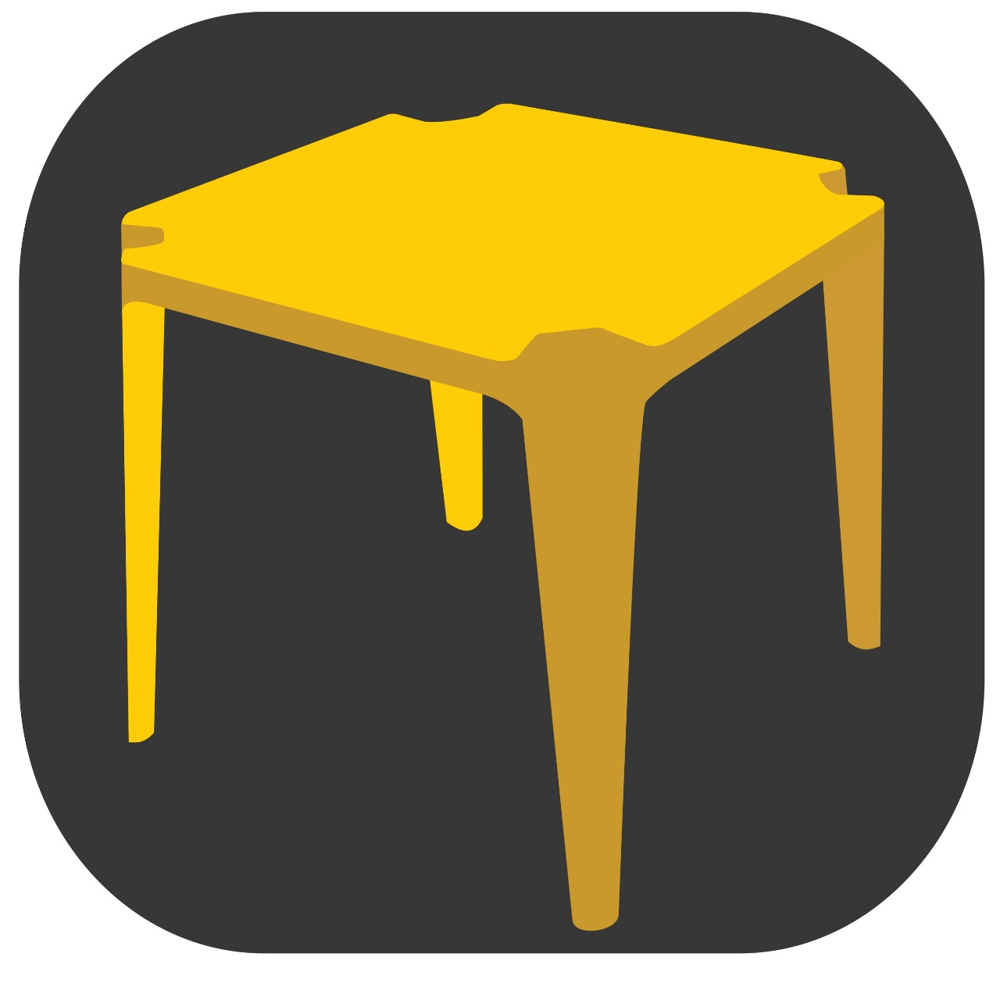

# Aplicativo No Boteco

Desafio Ambev Time 46

Repositório do projeto de aplicativo Android do Time 46, para solução do Desafio Ambev do MegaHack 3.0.

# Informações Técnicas

Plataforma: Android  
Ferramenta de Banco de Dados: Firebase (Firestore e Storage)  
Autenticação: Firebase Authentication (e-mail e senha)  
Bibliotecas de terceiros utilizadas:  
'me.dm7.barcodescanner:zxing:1.9.13' - implementação do leitor de QR Code. Mais informações [aqui]( https://github.com/dm77/barcodescanner)

# Sobre os bancos de dados

O aplicativo acessa e mantém dois bancos de dados:  
- Firebase Firestore: responsável por guardar as preferências dos usuários, bem como guardar a informação sobre usuários online em determinado bar. Além disso, o documento do   bar também possui uma coleção 'menu', responsável por repassar aos usuários a quantidade disponível de cada cerveja AMBEV que o bar possui.  

- Firebase Storage: responsável por salvar as imagens de perfil dos usuários.  

# Funcionalidades

O aplicativo possui duas funcionalidades principais:  
- Possibilidade de avaliar cervejas AMBEV (limitas à SKOL, BRAHMA, COLORADO, PATAGONIA e CORONA para fins de MVP) e salvar essas preferências no perfil pessoal  

- Acesso à cerveja favorita dos outros clientes do bar que estão logados através do Feed. Isso é feito através de uma Activity que se conecta ao banco de dados, no documento do   bar que o usuário está atualmente, buscando os users dentro da coleção 'users_online'.   

Além disso, é possível acompanhar o "Menu" do bar através de uma Activity que se conecta ao banco de dados e busca as informações atualizadas das cervejas disponíveis, com   quantidade (limitadas à SKOL, BRAHMA, COLORADO, PATAGONIA e CORONA para fins de MVP).  

# Como acontece?

Ao abrir o app, ele automaticamente verifica se o usuário está logado ou não. Se estiver logado, ele verifica se já efetuou a leitura de código QR e, portanto, já está conectado a um bar. Se sim, ele abre diretamente o Feed do bar, onde aparecem os outros usuários conectados no local, junto com a informação de sua cerveja favorita, nome e tempo no bar.  

Caso o usuário não esteja logado ao abrir o app, a tela de entrada aparecerá, onde o usuário pode tocar em "Acessar". Ao tocar nesse botão, a tela muda para tela de login, onde ele informa as credenciais. Após efetuar o login, o usuário é redirecionado para a tela do seu perfil, onde pode ver sua atividade recente (compras efetuadas nas ultimas 2 horas) bem como a sua lista de cervejas avaliadas, ordenada em ordem decrescente de avaliação da esquerda para direita. Nesse ponto, ainda não conectado ao Bar, o usuário pode fazer um swipe para a ACtivity à esquerda (swipe da esquerda para direita), onde visualizará o leitor de QR Code. Ao apontar esse leitor para o QR Code disponibilizado pelo estabelecimento, efetuará seu acesso e verá o Feed do bar.

Estando no Feed do Bar, o usuário pode fazer outro swipe à esquerda (da esquerda para direita) para acessar o Menu do estabelecimento, onde verá uma lista com as cervejas AMBEV disponíveis e as respectivas quantidades em estoque. O mesmo ocorre quando um swipe à direita (da direita para esquerda) é feito na Activity to Perfil quando o usuário já está em um Bar.

Por fim, no seu Perfil, o usuário pode tocar o botão "Sair". Ao tocar esse botão, ele é removido do Bar no qual está logado e desconectado da plataforma.
